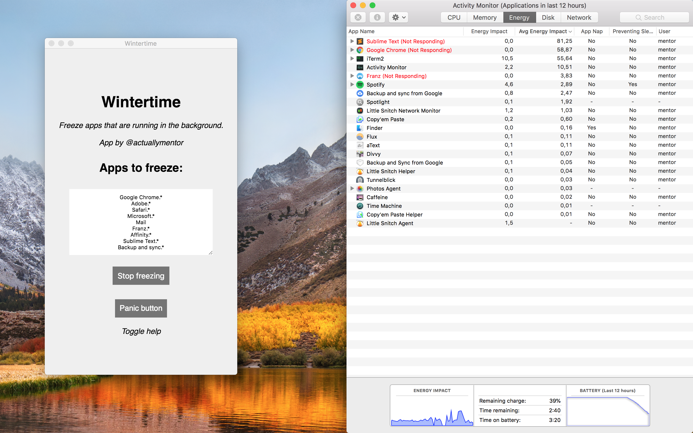

# Wintertime - Background App Freezer for Mac OSX

Sometimes applications start using a lot of CPU (and thus battery) for no apparent reason. It sucks when you are at home, but it sucks more when you are on the go operating on battery.

This application freezes processes that are not in focus (foreground). I use it to prevent applications like internet browsers, graphical processing and electron based applications from eating my battery.

Tested on High Sierra 10.13.5.

## Installation

Install the latest version from the [releases tab]( ./releases ). 

## Usage

- Open the app
- Change the preferences (or use the defaults)
- Click 'Start freezing'

When you want to stop the freezing process, click 'Stop freezing'.

If some some reason one of the frozen apps stays frozen, use the 'Panic button' to unfrost everything on your system.

## What it does

When you click freeze, the app will put the blacklisted apps in a 'Not Responding' mode, meaning they use 0% CPU. When you use yor mouse to click on a frozen window, it defrosts and re-opens.

## Notes to developers

The app is GUI that runs `pkill -CONT -u $(whoami) -f REGEX` for every item in the blacklist.

Pull requests for feature updates are welcome.